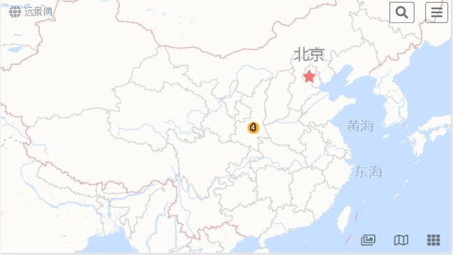
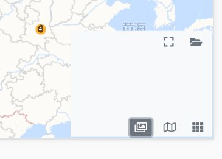
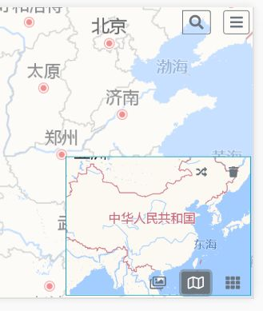
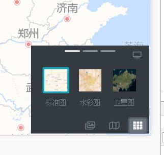

# 远景网用户手册

远景网是远程看房看景的一个手机应用，以三维导航和虚拟视野为基础，提供了
全景、直播、VR等看房看景的方式，给用户真实和客观的视觉体验和身临其境的
效果。

远景网不是一个搜索平台，而是一种全新的展示方式，结合三维地图，既可以把
地球上各个地方的事物客观真实的展现给用户，也可以看到各个地方的过去和历
史，从而全面的了解地球上一切事物的来源、现状和未来。

## 用户界面

打开远景网App之后，进入到主界面

右下角是三个切换开关

旋转木马用来显示和当前建筑物相关的图片、全景照片和文本等，左右滑动翻页

迷你地图显示不同层次的导航图，点击迷你导航图改变大地图的中心位置

设置大地图的显示方式，通过不同的视角来观察当前建筑物

## 基本功能

大地图显示层次分为五级:

* 集簇层

    使用集簇的方式显示全部的组织机构，点击集簇会进入区域层，集簇内的第
    一个组织机构显示在地图中间
    
* 区域层

    显示小范围内的组织机构，一般为一个城市或者地区。一个组织机构在地图
    上显示为一个图标，点击该图标进入组织机构层
    
* 组织机构层

    组织机构一般为一个小区，一个景点等，例如西部世纪城，华清御汤酒店，
    西北大学长安小区。

    显示组织机构内部的所有建筑物，点击对应的建筑物进入物层

* 建筑物或者楼层

    显示建筑物的楼层，以及每一个楼层对应的房间
    
* 房间

迷你地图中会列出每一个层次的导航图，可以通过迷你地图在不同层次之间切换。
如果删除某一层的导航图，其下各级图层也会被全部删除。

### 状态栏

在屏幕左下角是状态栏，显示当前远景网的模式和状态，例如 登录状态、直播模
式、导航模式等

点击状态栏，会弹出对应状态的功能菜单，例如注销、停止直播等

### 指北针按钮

在屏幕左侧，最上面的一个按钮是指北针按钮。

在静态模式，当地图旋转之后，会出现指北针按钮，指向正北方，点击按钮地图
自动返回到正北方向。

在动态模式，地图跟随手机朝向自动旋转，而指北针按钮始终指向地磁正北方向

### 定位按钮

在平面左侧，指北针按钮下面是定位按钮。

在室外模式下，点击按钮大地图自动切换到区域层的当前位置

在室内模式下，点击按钮自动定位在室内的位置

### 旋转木马

旋转木马用来显示当前图层的所有图片、全景和文字说明

## 应用场景

### 查看

1. 打开远景网 App

2. 搜索小区、景点

3. 通过旋转木马看所有相关图片、全景和文本

4. 切换到不同时代

### 直播

1. 打开远景网 App

2. 进入建筑物

    * 搜索小区、景点
    * 点击定位按钮
    * 从收藏中直接进入

3. 点击菜单项的直播（必须登录之后直播才可用）

4. 点击邀请，发送邀请短信、邮件、微信等

5. 观看直播

    * 被邀请用户点击短信、邮件、微信中的链接，观看直播
    * 被邀请用户进入相同建筑物，点击视野左上角的直播视野按钮
